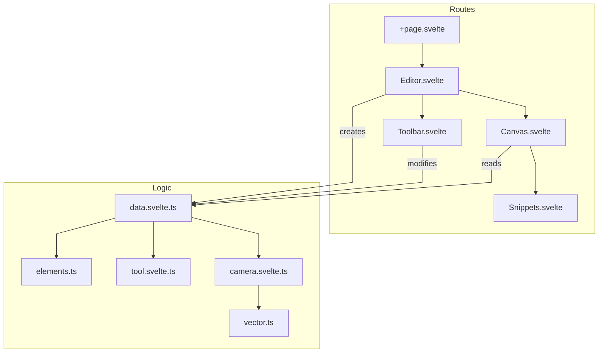

# Motion Whiteboard
A whiteboard app that lets users draw, animate with keyframes, and export to video. Works on PC and tablets.

## Todoist
https://app.todoist.com/app/project/motion-whiteboard-6fXXg66X9QFrhm4J

## Architecture



## File Structure

```
src/
├─ routes/
│  ├─ editor/
│  │  ├─ elements/
│  │  │  └─ Snippets.svelte  → Element renderers
│  │  ├─ Canvas.svelte       → Main drawing area
│  │  └─ Editor.svelte       → Main editor container
│  ├─ logic/
│  │  ├─ camera.svelte.ts    → Zoom & Pan logic
│  │  ├─ data.svelte.ts      → AppState & Entry point
│  │  ├─ elements.ts         → Element types (Point, Stroke)
│  │  ├─ tool.svelte.ts      → Tool logic (Brush, Eraser, Pan)
│  │  └─ vector.ts           → Math helpers
│  ├─ overlay/
│  │  └─ Toolbar.svelte      → Tool switching
│  └─ +page.svelte           → App Root
```

## TODO:
 - erasing
 - eraser trail 殘影 like in osu
 - saving
 - toolbar
 - text
 - img
 - undo/redo
 

## sv

Everything you need to build a Svelte project, powered by [`sv`](https://github.com/sveltejs/cli).


## Creating a project

If you're seeing this, you've probably already done this step. Congrats!

```sh
# create a new project in the current directory
npx sv create

# create a new project in my-app
npx sv create my-app
```

## Developing

Once you've created a project and installed dependencies with `npm install` (or `pnpm install` or `yarn`), start a development server:

```sh
npm run dev

# or start the server and open the app in a new browser tab
npm run dev -- --open
```

## Building

To create a production version of your app:

```sh
npm run build
```

You can preview the production build with `npm run preview`.

> To deploy your app, you may need to install an [adapter](https://svelte.dev/docs/kit/adapters) for your target environment.
