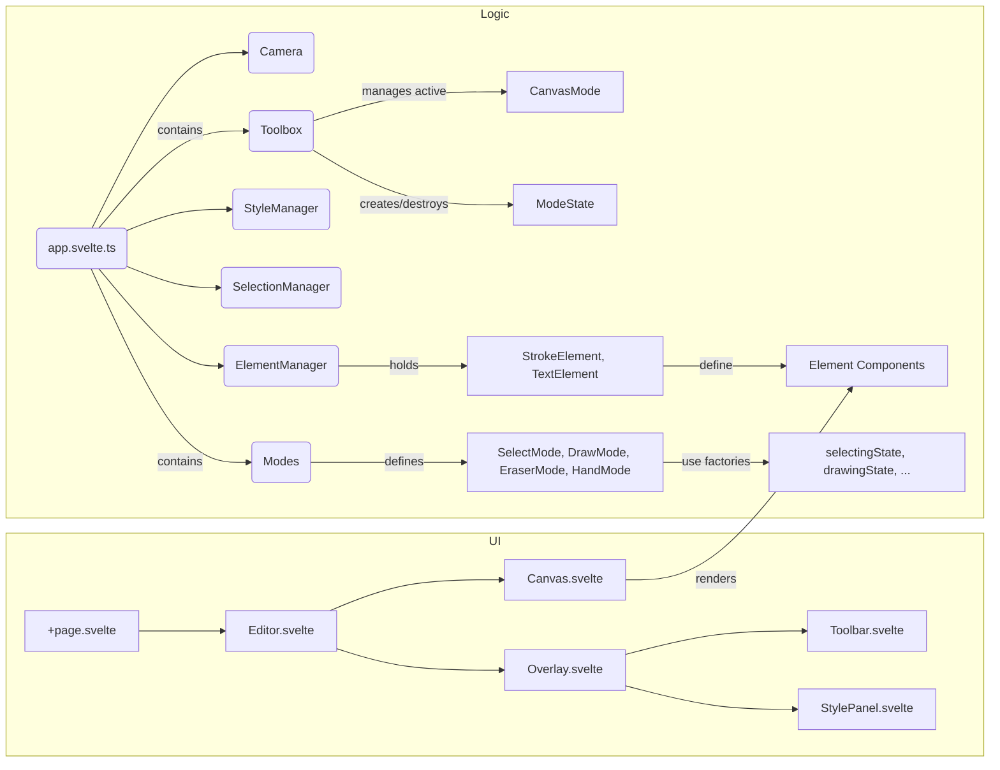
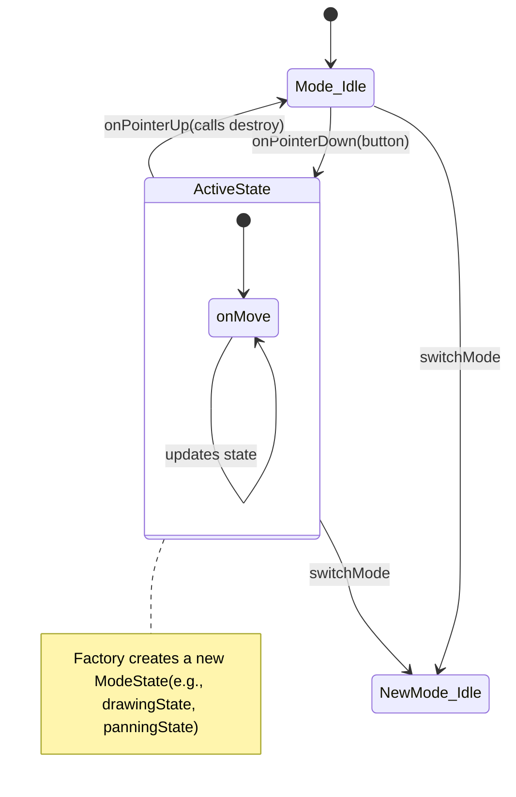

# Motion Whiteboard
A whiteboard app that lets users draw, animate with keyframes, and export to video. Works on PC and tablets.

## Dependencies
 - bun
 - svelte
 - lucide icons

## Architecture



## Interaction State Machine

The `Toolbox` manages the transition between modes and the active interaction state.



## File Structure

```
src/
├─ routes/
│  ├─ ui/                      → UI Components (Svelte)
│  │  ├─ layers/               → Mode-specific UI layers
│  │  ├─ Canvas.svelte         → Main drawing area
│  │  ├─ Editor.svelte         → Layout container
│  │  ├─ Overlay.svelte        → UI Layer container
│  │  ├─ StylePanel.svelte     → Style pickers
│  │  └─ Toolbar.svelte        → Tool switcher
│  ├─ logic/                   → Core Logic
│  │  ├─ element/              → Polymorphic Elements
│  │  │  ├─ stroke/            → Stroke Element & View
│  │  │  ├─ text/              → Text Element & View
│  │  │  └─ elements.svelte.ts → Provider implementation
│  │  ├─ interface/            → Shared contracts
│  │  ├─ manager/              → System managers
│  │  │  ├─ camera.svelte.ts   
│  │  │  ├─ cursors.svelte.ts  
│  │  │  ├─ style_manager.svelte.ts
│  │  │  └─ toolbox.svelte.ts  
│  │  ├─ mode/                 → Mode System
│  │  │  ├─ state/             → Functional State Factories
│  │  │  │  ├─ drawing.svelte.ts
│  │  │  │  ├─ erasing.svelte.ts
│  │  │  │  ├─ pan.svelte.ts
│  │  │  │  └─ select.svelte.ts
│  │  │  ├─ modes.svelte.ts    → Mode definitions
│  │  │  └─ state.svelte.ts    → Base state types
│  │  ├─ math/                 → Utilities
│  │  │  ├─ stroke.ts          
│  │  │  └─ vector.ts          
│  │  └─ app.svelte.ts         → Main entry point (AppState)
│  └─ +page.svelte             → App Root
├─ app.css                     → Global styles & variables
```

## Structural Improvements / Future Considerations

1. **Service Locator / DI**: As `AppState` grows, consider a more formal dependency injection or service locator pattern for managers to avoid passing the whole `AppState` or long constructor lists.
2. **Element Serialization**: Now that elements are classes, adding `toJSON` and `fromJSON` methods to the `Element` interface will be crucial for persistence.
3. **Command Pattern**: Implement an undo/redo system by wrapping `ElementManager` operations in command objects.
4. **Render Layering**: While highlights are currently in a separate loop, as the number of elements grows, consider a single pass or spatial indexing (like a QuadTree) for hit-testing and occlusion culling.


## Develop
```sh
# initialize package
bun install

# start the server
bun run dev

# To create a production version of your app:
bun run build

# to preview the production build:
bun run preview

# to deploy your app, you may need to install an [adapter](https://svelte.dev/docs/kit/adapters) for your target environment.
```