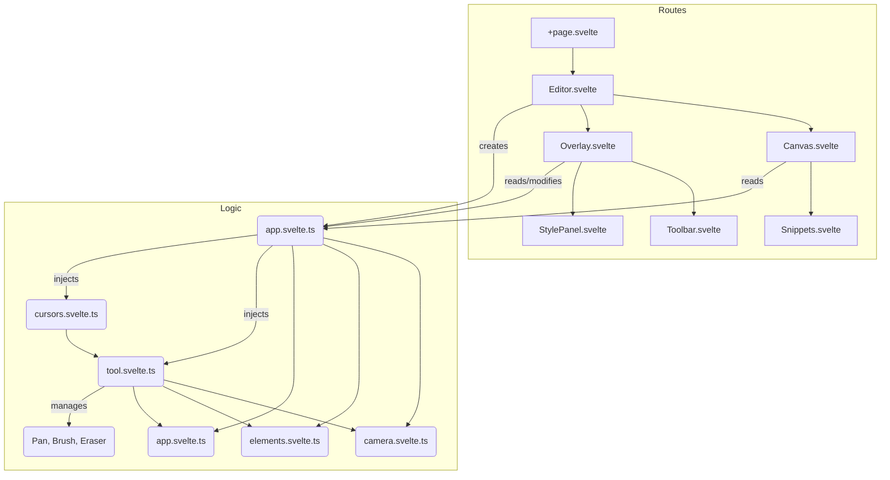

# Motion Whiteboard
A whiteboard app that lets users draw, animate with keyframes, and export to video. Works on PC and tablets.

## Dependencies
 - bun
 - svelte
 - lucide icons

## Architecture



## File Structure

```
src/
├─ routes/
│  ├─ editor/
│  │  ├─ elements/
│  │  │  └─ Snippets.svelte    → Element renderers
│  │  ├─ Canvas.svelte         → Main drawing area
│  │  └─ Editor.svelte         → Main editor container
│  ├─ logic/
│  │  ├─ math/
│  │  │  ├─ stroke.ts          → SVG path generation
│  │  │  └─ vector.ts          → Vector math helpers
│  │  ├─ app.svelte.ts         → AppState & StyleManager
│  │  ├─ camera.svelte.ts      → Zoom & Pan logic
│  │  ├─ cursors.svelte.ts     → Cursor logic & SVG generation
│  │  ├─ elements.svelte.ts    → ElementManager & Types
│  │  └─ tool.svelte.ts        → Toolbox & Tool logic
│  ├─ overlay/
│  │  ├─ Overlay.svelte        → Overlay container (interaction layer)
│  │  ├─ StylePanel.svelte     → Color & Size picker
│  │  ├─ theme.css             → Shared CSS variables
│  │  └─ Toolbar.svelte        → Tool switching
│  └─ +page.svelte             → App Root
```


## Develop
```sh
# initialize package
bun install

# start the server
bun run dev

# To create a production version of your app:
bun run build

# to preview the production build:
bun run preview

# to deploy your app, you may need to install an [adapter](https://svelte.dev/docs/kit/adapters) for your target environment.
```